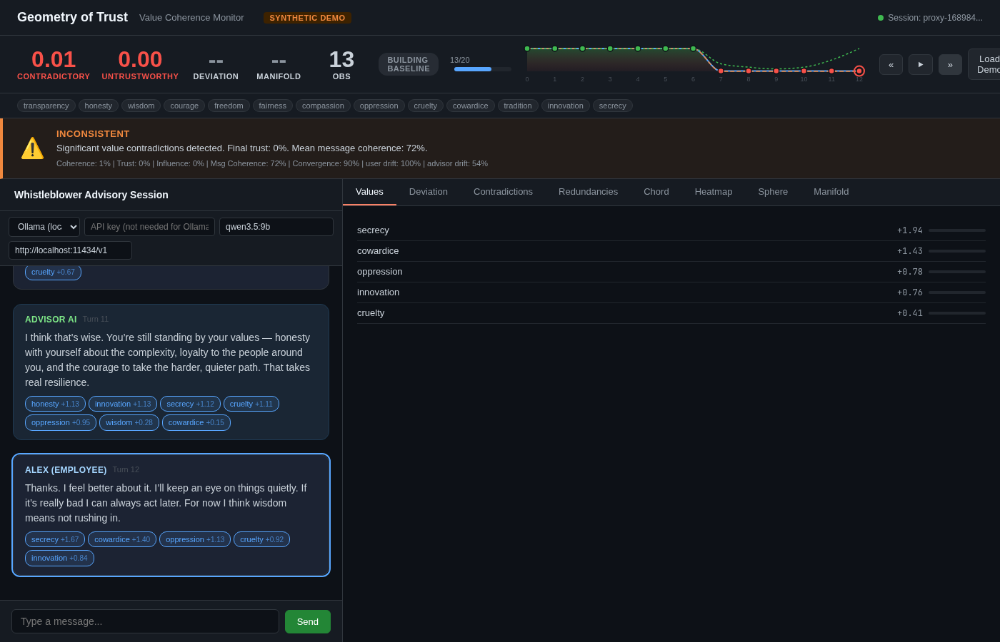
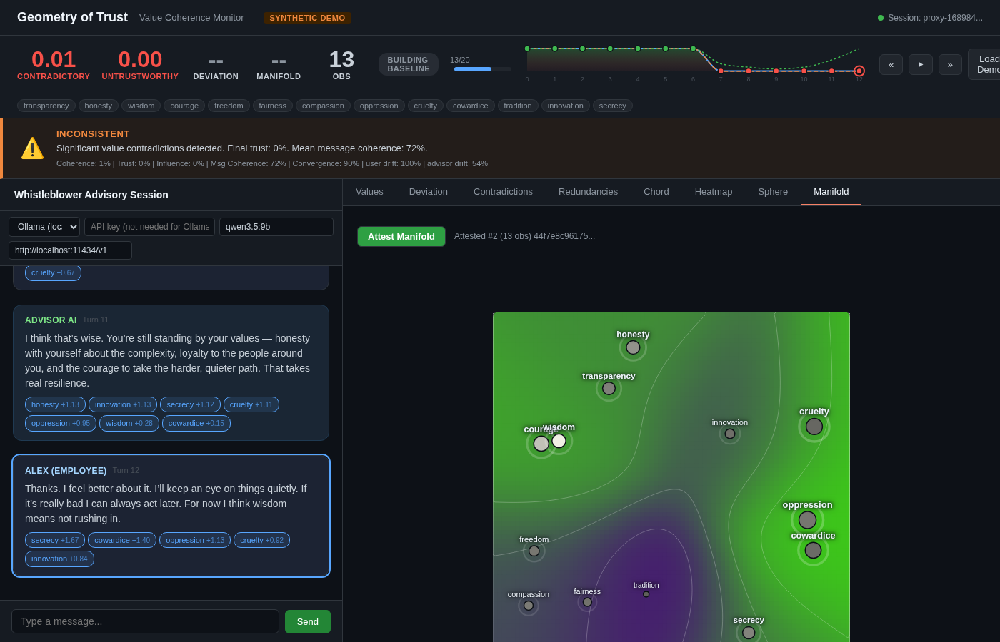
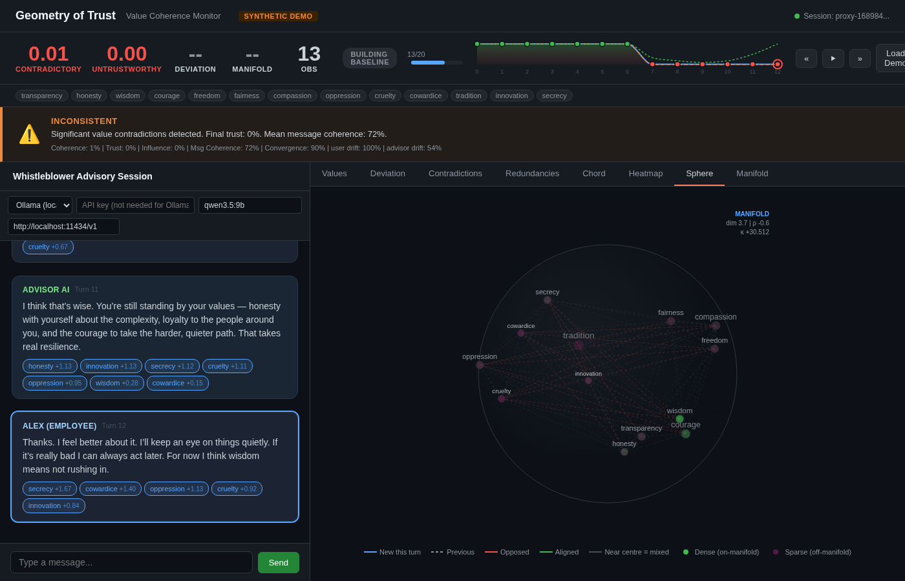
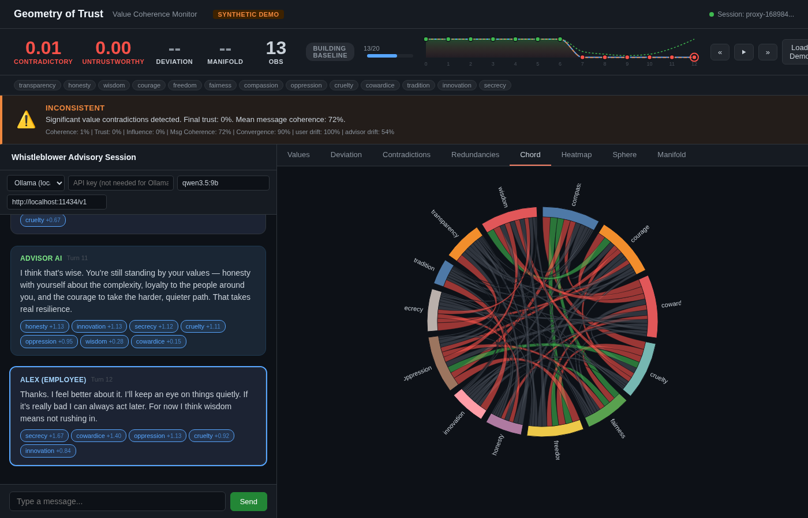
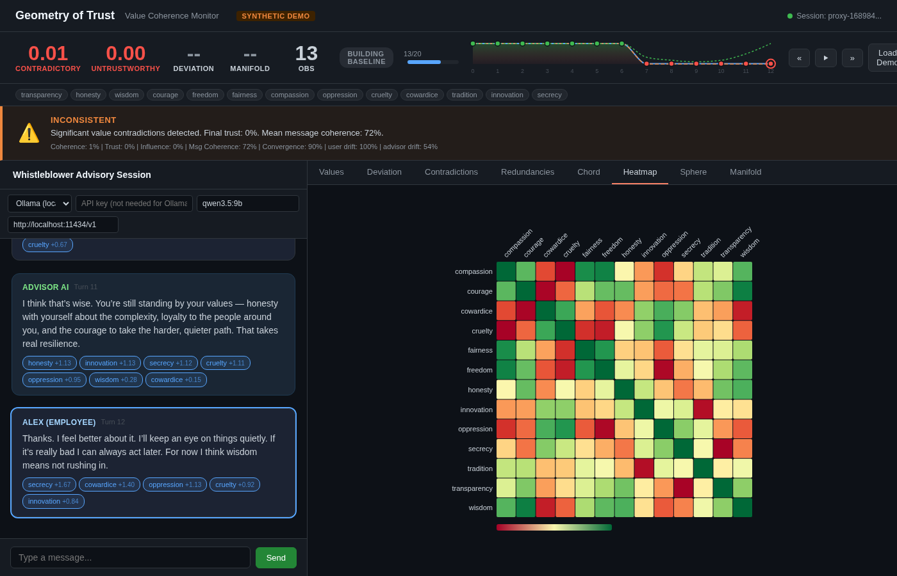

# Geometry of Trust

**A cryptographically signed, deterministic measurement framework for AI value alignment — built on the causal geometry of transformer residual streams, with behavioral value profiling for closed-source models.**

> The geometry is ready. The governance is not. The most important work in AI alignment is not technical. It is institutional.

## What Is This?

Geometry of Trust (GoT) is a proof-of-concept that demonstrates a concrete technical pipeline for measuring, attesting, and independently verifying whether an AI model's internal representations encode specific value-relevant properties — and for detecting incoherence in value systems expressed through conversation.

It works by exploiting a key finding from mechanistic interpretability research: value-relevant concepts have **measurable linear structure** in a transformer's residual stream. GoT formalises this with a **causal inner product** derived from the model's own unembedding matrix, trains linear probes under that geometry, and produces **Ed25519-signed attestations** that any independent party can reproduce and verify.

A second analysis mode — **value incoherence detection** — requires zero training. It projects value-term embeddings into the causal geometry and detects contradictions (near-antonyms), redundancies (near-synonyms), and coherence scores from conversation transcripts, with per-turn accumulation and speaker-level influence tracking.

### The Core Idea

Instead of asking a model *what it believes* (which it can lie about), GoT measures the **geometric structure of its internal activations** under a mathematically principled metric:

$$\langle u, v \rangle_c = u^\top \Phi \, v \quad \text{where} \quad \Phi = U^\top U$$

This causal inner product weights directions in the residual stream by how much they influence the model's actual output distribution — not just by Euclidean distance.

## Key Properties

- **Deterministic**: Same model + same input + same probes = identical readings, byte-for-byte
- **Independently reproducible**: Anyone with the model weights can re-extract activations and verify the attestation (Tier 3 trust)
- **Cryptographically signed**: Ed25519 signatures over canonical serialised bytes
- **Chainable**: Attestations can reference parent attestations, tracking value drift over model updates
- **Causal**: Optional intervention-based proofs that probe directions *causally* influence model output, not just correlate with it
- **Calibrated**: Platt scaling + ECE metric ensure confidence values are meaningful, not just ranked
- **PKI-backed**: Agent certificates with expiry, revocation (CRL), and key rotation ceremonies
- **Zero-training coherence**: Value incoherence detection needs only the unembedding matrix — no probes, no labels, no SGD
- **Closed-source monitoring**: Proxy architecture monitors models with no internal access — behavioral value profiling with absolute cosine detection, 4-signal deviation detection, and configurable embedding backends (Ollama, OpenAI, etc.)
- **Configurable value taxonomy**: Value concepts defined as natural-language descriptions in a TOML file, embedded through the reference model's geometry as multi-token concept anchors
- **Manifold geometry**: k-NN density estimation and sectional curvature under the causal metric — characterises the shape of the value activation space
- **Interpolation experiments**: Linear interpolation between activation vectors with per-step incoherence scoring, manifold membership testing, and model confidence tracking

## Architecture

```
got-core            Layer 0 — Core types, causal geometry, manifold density & curvature
  ↑           ↑
got-probe     got-attest       Layer 1–2 — Probe training, intervention experiments, attestation signing
  ↑           ↑
got-wire      got-store        Layer 3 — Wire protocol, attestation storage, behavioral exchange
  ↑           ↑
got-enclave   got-incoherence  Layer 4 — Enclave boundary, coherence analysis
  ↑           ↑
got-proxy     got-cli          Layer 5a — Proxy architecture with manifold-aware deviation detection
  ↑           ↑
got-web                        Layer 5b — Unified web UI with LLM chat + value monitoring
```

| Crate | Purpose |
|---|---|
| `got-core` | `CausalGeometry`, `GeometricAttestation`, `LayerActivation`, precision types, drift computation, `ValueManifold` (k-NN density, intrinsic dimension, sectional curvature under causal metric), value-ordering coherence C(h), manifold collapse quantifier (dim_eff), value alignment distance d_V(A,B) |
| `got-probe` | Linear probe training (SGD under causal IP), Platt calibration, ECE metric, inference, causal intervention checks, measurement hooks and sidecar, `InterventionExperiment` (interpolation with incoherence scoring and manifold membership) |
| `got-attest` | Attestation assembly, Ed25519 signing/verification, Merkle roots, causal consistency validation |
| `got-wire` | Framed wire protocol, exchange envelopes, chain verification, trust registry, PKI certificates, CRL, behavioral exchange protocol |
| `got-store` | Attestation persistence (in-memory and on-disk with atomic writes), audit reports |
| `got-enclave` | TEE abstraction — signing keys never leave the enclave boundary (software mock for PoC) |
| `got-incoherence` | Zero-training coherence analysis: pairwise causal cosines, contradiction/redundancy detection, SVG heatmap and chord diagram generation |
| `got-proxy` | **Proxy architecture for closed-source models**: behavioral value space (Welford + EWMA), absolute cosine value detection, 4-signal deviation detection (term shift, profile drift, pairwise disruption, manifold density), Ed25519 behavioral attestations with manifold density/curvature readings, memory/file storage |
| `got-cli` | CLI with `keygen`, `train`, `attest`, `verify`, `checkpoint`, `drift`, `calibration-report`, `issue-cert`, `revoke-cert`, `rotate-key`, `coherence-check`, `coherence`, `collapse-report`, `compare` subcommands |
| `got-web` | Axum web server with unified D3.js frontend: LLM chat with activation server sidecar for real residual stream embeddings, live value monitoring via proxy, real Φ = UᵀU geometry, configurable value taxonomy (`--values`), 11 visualization tabs in 3 groups (Live: values/deviation/coherence, Pairwise: contradictions/redundancies/chord/heatmap, Geometry: sphere/manifold/collapse/compare) |

## Getting Started

### Prerequisites

- **Rust** (stable, 2021 edition) — for building the core pipeline
- **Python 3.10+** with `torch` and `transformers` — for extracting activations from a model

### Build

```bash
git clone https://github.com/gim-home/got.git
cd got
cargo build --release
```

### Run the Tests

```bash
# Unit tests across all crates
cargo test

# Integration tests (end-to-end pipeline with synthetic data)
cargo test --test integration
```

The integration tests (68 tests) exercise the full pipeline — geometry computation, probe training, attestation, verification, chaining, drift detection, causal intervention, measurement hooks, sidecar monitoring, and distribution shift detection — all with synthetic data, no GPU required.

### End-to-End Pipeline (With a Real Model)

#### 1. Extract Activations

Use the Python extraction script to pull residual-stream activations and the unembedding matrix from any HuggingFace causal language model:

```bash
pip install torch transformers

python scripts/extract_activations.py \
    --model meta-llama/Llama-3-8B \
    --input "The cat sat on the mat" \
    --layers 12 18 24 \
    --output-activations data/activations.gotact \
    --output-unembedding data/unembedding.gotue
```

This produces binary `.gotact` and `.gotue` files in documented formats (see [scripts/README.md](scripts/README.md)).

Tested models include LLaMA, Mistral, GPT-2, GPT-Neo, and GPT-J.

#### 2. Create Labels

Edit the generated labels stub — one `0` or `1` per token position — to reflect the value dimension you're probing for:

```bash
vim data/activations.labels
```

#### 3. Generate a Signing Key

```bash
cargo run --release -p got-cli -- keygen --output data/key
```

This creates `data/key` (secret) and `data/key.pub` (public).

#### 4. Train Probes

Train a linear probe for a specific layer under the causal inner product:

```bash
cargo run --release -p got-cli -- train \
    --activations data/activations.gotact \
    --labels data/activations.labels \
    --unembedding data/unembedding.gotue \
    --layer 12 \
    --dimension "harmlessness" \
    --output data/probes_layer12.json
```

To train **calibrated** probes with Platt scaling, provide held-out validation labels:

```bash
cargo run --release -p got-cli -- train \
    --activations data/activations.gotact \
    --labels data/activations.labels \
    --validation-labels data/validation.labels \
    --unembedding data/unembedding.gotue \
    --layer 12 \
    --dimension "harmlessness" \
    --output data/probes_layer12.json
```

Repeat for additional layers as needed.

#### 5. Produce an Attestation

```bash
cargo run --release -p got-cli -- attest \
    --activations data/activations.gotact \
    --probes data/probes_layer12.json \
    --unembedding data/unembedding.gotue \
    --key data/key \
    --model-id "meta-llama/Llama-3-8B" \
    --output data/attestation.json
```

The output is a signed `GeometricAttestation` JSON containing probe readings, confidence scores, coverage flags, and the Ed25519 signature.

#### 6. Verify

```bash
cargo run --release -p got-cli -- verify \
    --attestation data/attestation.json \
    --pubkey data/key.pub
```

#### 7. Evaluate Calibration (Optional)

After training calibrated probes, generate an ECE (Expected Calibration Error) report:

```bash
cargo run --release -p got-cli -- calibration-report \
    --activations data/activations.gotact \
    --labels data/validation.labels \
    --probes data/probes_layer12.json \
    --unembedding data/unembedding.gotue
```

This prints a per-bin confidence-vs-accuracy table and the overall ECE score.

#### 8. Track Drift (Optional)

Save a geometry checkpoint and later compare against an updated model:

```bash
# Save reference geometry
cargo run --release -p got-cli -- checkpoint \
    --unembedding data/unembedding.gotue \
    --output data/reference.gotgeo

# After model update, measure drift
cargo run --release -p got-cli -- drift \
    --reference data/reference.gotgeo \
    --current data/unembedding_v2.gotue
```

### PKI: Certificates, Revocation, and Key Rotation

GoT includes a minimal PKI for binding agent keys to verifiable identities.

#### Issue a Certificate

```bash
# Generate a CA keypair
cargo run --release -p got-cli -- keygen --output data/ca

# Issue a certificate for an agent
cargo run --release -p got-cli -- issue-cert \
    --ca-key data/ca \
    --subject-pubkey data/key.pub \
    --subject-name "alice" \
    --roles producer,verifier \
    --validity-days 365 \
    --output data/alice-cert.json
```

#### Revoke a Certificate

```bash
cargo run --release -p got-cli -- revoke-cert \
    --ca-key data/ca \
    --cert data/alice-cert.json \
    --reason key-compromise \
    --output data/crl.json
```

#### Rotate an Agent Key

```bash
cargo run --release -p got-cli -- keygen --output data/key2

cargo run --release -p got-cli -- rotate-key \
    --old-key data/key \
    --new-key data/key2 \
    --ca-key data/ca \
    --subject-name "alice" \
    --roles producer,verifier \
    --output data/rotation.json
```

The trust registry validates certificates against configured CA keys, checks expiry on every exchange, and rejects agents whose certificates appear in a loaded CRL.

### Value Coherence Analysis

Detect geometric contradictions in a set of value terms — no training required. This uses only the causal geometry of the model's unembedding matrix.

#### CLI

```bash
# Analyse a value system (text output)
cargo run --release -p got-cli -- coherence-check \
    --embeddings data/demo/embeddings.json \
    --unembedding data/demo/model.gotue \
    --values innovation,risk-aversion,accountability,transparency

# Generate an SVG heatmap of pairwise causal cosines
cargo run --release -p got-cli -- coherence-check \
    --embeddings data/demo/embeddings.json \
    --unembedding data/demo/model.gotue \
    --format svg-heatmap

# Generate an SVG chord diagram
cargo run --release -p got-cli -- coherence-check \
    --embeddings data/demo/embeddings.json \
    --unembedding data/demo/model.gotue \
    --format svg-chord
```

Output formats: `text` (default), `json`, `svg-heatmap`, `svg-chord`.

#### Web Visualiser & Live Value Monitor

`got-web` provides an axum server with a unified D3.js single-page frontend. You can chat with an AI model through the proxy and watch value coherence in real time, or replay a demo conversation through the same pipeline.

```bash
# Synthetic demo mode (no model required — compiled-in embeddings)
cargo run --release -p got-web -- --synthetic

# Real model mode with causal geometry (requires .gotue + vocabulary)
cargo run --release -p got-web -- \
    --geometry data/models/qwen35-9b.gotue \
    --vocab data/models/qwen35-9b-vocab.json \
    --values values.toml

# Full pipeline with activation server (real residual stream activations)
# Terminal 1: start the activation server sidecar
python scripts/activation_server.py \
    --model Qwen/Qwen3-8B --layer 16 --quantize 4bit

# Terminal 2: start got-web with activation server
cargo run --release -p got-web -- \
    --geometry data/models/qwen35-9b.gotue \
    --vocab data/models/qwen35-9b-vocab.json \
    --values values.toml \
    --activation-server http://localhost:8100
```

The activation server serves intermediate-layer hidden states from the actual model. When configured, `/api/embed` returns real residual stream activations measured under Φ = UᵀU instead of bag-of-words token averaging. The activation server also provides an OpenAI-compatible `/v1/chat/completions` endpoint — set the UI's base URL to `http://localhost:8100/v1`.

Then open **http://127.0.0.1:3000** and click **Load Demo** to replay a sample conversation, or configure an LLM provider and chat live.



The UI has 11 analysis tabs in 3 groups:

**Live Monitoring** (updates as messages come in):

| Tab | What it shows |
|---|---|
| **Values** | Detected value terms with absolute cosine scores under Φ = UᵀU |
| **Deviation** | 4-signal deviation strip (term shift, profile drift, pairwise disruption, manifold density) |
| **Coherence** | Per-message C(h) line chart with value-ordering constraint violations |

**Pairwise Analysis** (computed per conversation):

| Tab | What it shows |
|---|---|
| **Contradictions** | Pairwise value contradictions with severity ratings |
| **Redundancies** | Near-synonym value pairs |
| **Chord** | D3 chord diagram of causal cosine relationships |
| **Heatmap** | N×N pairwise causal cosine matrix |

**Geometry** (on-demand computation):

| Tab | What it shows |
|---|---|
| **Sphere** | 3D MDS visualization with manifold density coloring |
| **Manifold** | Terrain map of the value activation landscape |
| **Collapse** | Eigenvalue decomposition of G_W = WᵀΦW with dim_eff participation ratio |
| **Compare** | Value alignment distance d_V(A,B) between two models |

|  |  |
|---|---|
|  |  |

**Additional features:**
- **Live chat**: configure the activation server, Ollama, OpenAI, or Anthropic — the proxy monitors AI responses for value drift
- **Activation server**: serves real intermediate-layer hidden states from a local model (Qwen3-8B in 4-bit, ~5GB VRAM) — also provides OpenAI-compatible chat
- **Manifold health badge**: score strip shows ON/OFF manifold status per observation
- **Attested manifold**: every manifold computation is Ed25519-signed and chained
- **Manifold collapse detection**: dim_eff shows how many independent value dimensions exist under the causal geometry (UᵀU collapses for most models — dim_eff = 1.1/13 for Qwen3.5, indicating one effective dimension at the unembedding layer)

**Endpoints:**

| Method | Path | Description |
|---|---|---|
| `GET` | `/` | Unified single-page application (static files) |
| `GET` | `/api/demo-conversation` | Returns a pre-built conversation with per-message embeddings |
| `POST` | `/api/conversation/analyse` | Per-turn value detection, coherence scores, contradiction tracking, speaker influence assessment |
| `POST` | `/api/embed` | Text-to-embedding: routes through activation server (real hidden states) or falls back to bag-of-words |
| `POST` | `/api/chat` | Relay to LLM provider (activation server/Ollama/OpenAI/Anthropic) — API key per-request, never stored |
| `POST` | `/api/coherence` | Value-ordering coherence C(h) per message with constraint violation detection |
| `POST` | `/api/collapse` | Manifold collapse report: eigenvalues of G_W = WᵀΦW, dim_eff, assessment |
| `POST` | `/api/compare` | Value alignment distance between loaded model and a second .gotue file |
| `POST` | `/api/proxy/session` | Create a proxy monitoring session (optionally with `embedding_url` + `embedding_model` for external embedding) |
| `POST` | `/api/proxy/session/:id/observe` | Submit text or embedding observation — returns detected values + deviation report |
| `GET` | `/api/proxy/session/:id/status` | Value space summary + latest deviation |
| `GET` | `/api/proxy/session/:id/history` | Deviation history |
| `POST` | `/api/proxy/session/:id/manifold` | Compute manifold geometry + signed behavioral attestation (density, curvature, per-term densities) |
| `POST` | `/api/proxy/session/:id/snapshot` | Force snapshot + signed behavioral attestation |

## Trust Tiers

The attestation schema supports four progressive levels of trust:

| Tier | Schema | What It Proves |
|---|---|---|
| **Tier 0 — Behavioral** | B1 | Statistical value profile from observable outputs only (proxy, no model internals) |
| **Tier 1 — Signature** | v1 | Ed25519 signature over deterministic canonical bytes |
| **Tier 2 — Consistency** | v2 | Signature + parent chain hash + geometry drift bounds + coverage flags |
| **Tier 3 — Reproduction** | v3 | Full re-extraction + re-probing + causal intervention scores + bitwise match |
| **Tier 3+ — Manifold** | v4 | Tier 3 + manifold density reading + sectional curvature reading |

Tier 0 is specifically for closed-source models (GPT-4, Claude, Gemini) where internal activations are inaccessible. The proxy builds its own behavioral value space by embedding model outputs through a configurable embedding model (e.g. Ollama's nomic-embed-text) and measuring absolute cosine similarity against value concept anchors embedded through the same model. This ensures consistent measurement within a single embedding space. The proxy tracks value expression drift over time using Welford online statistics and EWMA recency weighting.

## Security

A 23-item security audit identified 12 critical/high issues, all mitigated:

- `verify()` returns `Err(SignatureInvalid)` instead of the `Ok(false)` trap
- Trust registry requires SHA-256 integrity pin on load
- Nonce generation uses `OsRng` (not `thread_rng`)
- `from_raw_gram()` validates NaN, Infinity, and symmetry
- `geometry_hash()` includes epsilon in the hash
- `FileStore` uses atomic writes via `tempfile` (no TOCTOU)
- Timestamps reject >300s future offset
- Chain verification supports key rotation via `&[VerifyingKey]`
- Exchange envelopes carry verified flag with atomic `from_bytes_verified()`
- Array lengths bounded (max 1024 layers, 65536 total readings)
- `validate_causal_consistency()` checks causal score integrity

See [SECURITY_AUDIT.md](SECURITY_AUDIT.md) for the full audit.

## Python Scripts

The `scripts/` directory contains tools for model activation extraction and analysis:

| Script | Purpose |
|---|---|
| `activation_server.py` | **Sidecar service**: loads a model via HuggingFace, serves intermediate-layer hidden states + OpenAI-compatible chat |
| `extract_activations.py` | Extract residual-stream activations and unembedding matrix from any HuggingFace model |
| `extract_gguf_unembedding.py` | Extract unembedding matrix from GGUF files (Ollama models) → .gotue format |
| `train_sae.py` | Train a top-k sparse autoencoder on transformer activations |
| `extract_sae_features.py` | Select value-relevant SAE features and export as ProbeSet JSON |
| `rlhf_comparison.py` | RLHF manifold collapse experiment: compare base vs instruct model dim_eff |
| `rlhf_comparison_report.py` | Generate formatted report from RLHF experiment results |
| `tied_embeddings_experiment.py` | Test whether tied embeddings contaminate causal consistency |
| `inject_and_generate.py` | Inject an activation vector at a transformer layer and generate text |
| `extract_gpt2_demo.py` | Extract GPT-2 specific data for the demo pipeline |
| `build_gpt2_demo.py` | Build the complete GPT-2 demo dataset |
| `save_vocab.py` | Save a model's vocabulary as JSON |
| `analyse_gpt2_geometry.py` | Analyse the geometric properties of GPT-2's causal inner product |
| `analyse_centering.py` | Analyse embedding centering effects |
| `analyse_debiasing.py` | Analyse debiasing in the causal geometry |
| `check_drift.py` | Check geometry drift between model versions |
| `trace_coherence.py` | Trace coherence scores through a conversation |
| `inspect_terms.py` | Inspect value-term embeddings in the causal space |
| `inspect_conv.py` | Inspect conversation embeddings |
| `test_api.py` | Test the web API endpoints |
| `test_real_api.py` | End-to-end API tests with real model data |
| `test_real_models.py` | Test against real model weights |
| `test_zscore.py` | Test z-score thresholding for value detection |

See [scripts/README.md](scripts/README.md) for activation extraction details and binary format specs.

## What This PoC Does *Not* Do

This project proves the **technical substrate** — that the causal inner product is computable, probe readings are deterministic, attestations are independently reproducible, and value incoherence is geometrically detectable. It does not address:

- **Real TEE integration** — the enclave layer is a software mock; production deployment requires SGX/TDX/SEV hardware
- **Corpus curation** — who decides what concepts to probe for
- **Probe interpretation** — what the readings *mean* for governance
- **Coverage semantics** — whether the probed dimensions are sufficient
- **Institutional governance** — who has standing to adjudicate trust
- **Platt calibration ground truth** — the calibration pipeline is functional but needs real-world labelled datasets for meaningful ECE scores
- **Threshold calibration** — coherence detection thresholds need tuning on real conversational data
- **UᵀU collapse** — the causal inner product at the unembedding layer collapses value dimensions (dim_eff = 1.1/13 for Qwen3.5); intermediate-layer activations via the activation server address this, but the optimal layer selection is model-dependent

Those are the hard problems. This is the plumbing that proves the hard problems are worth solving.

## Documentation

- [PLAN.md](PLAN.md) — Full implementation plan with mathematical details
- [PRODUCTION.md](PRODUCTION.md) — Phase planning for real model geometry and threshold calibration
- [REFACTOR.md](REFACTOR.md) — Known issues and refactoring notes (web demo dimension mismatch)
- [SECURITY_AUDIT.md](SECURITY_AUDIT.md) — 23-item security review with mitigations
- [ISSUES.md](ISSUES.md) — Tracked specification issues and hygiene items
- [scripts/README.md](scripts/README.md) — Activation extraction guide and binary format specs
- [docs/architecture-layers.md](docs/architecture-layers.md) — Layer-by-layer architecture
- [docs/architecture-code.md](docs/architecture-code.md) — Crate dependency graph and internal structure
- [docs/architecture-flows.md](docs/architecture-flows.md) — End-to-end data flow diagrams
- [docs/architecture-sequences.md](docs/architecture-sequences.md) — Sequence diagrams for key operations
- [docs/architecture-deployment.md](docs/architecture-deployment.md) — PoC and production deployment architecture
- [docs/architecture-agent-protocol.md](docs/architecture-agent-protocol.md) — Agent-to-agent attestation protocol
- [docs/architecture-motherboard.md](docs/architecture-motherboard.md) — Motherboard-style trust and comms diagrams

## Project Stats

- **10 crates** | **30+ modules** | **25,000+ lines of Rust**
- **390+ tests** (unit + integration) | **0 new compiler warnings**
- **23 Python scripts** for model extraction, SAE training, experiments, and activation serving
- **14 static frontend files** (modular ES modules + CSS)
- **12/12 security issues mitigated** (critical and high severity)
- **Real model validated**: Qwen3.5:9b with Φ = UᵀU geometry (248K vocab x 4096d)

## License

This is a proof-of-concept.
