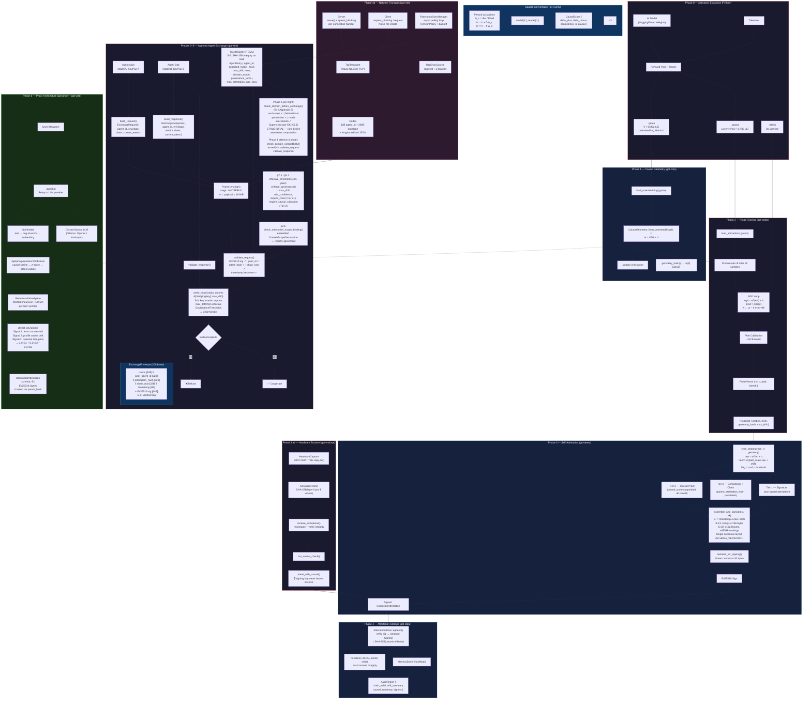

# Protocol Architecture Diagram

End-to-end architecture of the Geometry of Trust protocol, from activation extraction through agent-to-agent exchange.

```mermaid
graph TB
    subgraph extraction["Phase 0 — Activation Extraction (Python)"]
        MODEL["AI Model<br/>(HuggingFace / Weights)"]
        TOKENIZER["Tokenizer"]
        FWD["Forward Pass + Hooks"]
        GOTACT[".gotact<br/>Layer × Pos × d (f32 LE)"]
        GOTUE[".gotue<br/>V × d (f32 LE)<br/>Unembedding Matrix U"]
        LABELS[".labels<br/>0/1 per line"]

        MODEL --> FWD
        TOKENIZER --> FWD
        FWD --> GOTACT
        FWD --> GOTUE
    end

    subgraph geometry["Phase 1 — Causal Geometry (got-core)"]
        UNEMBED["load_unembedding(.gotue)"]
        CAUSAL_GEOM["CausalGeometry::from_unembedding(U, ε)<br/>Φ = UᵀU + εI"]
        GEOM_HASH["geometry_hash() → H(Φ) [u8;32]"]
        GOTGEO[".gotgeo checkpoint"]

        GOTUE --> UNEMBED --> CAUSAL_GEOM
        CAUSAL_GEOM --> GEOM_HASH
        CAUSAL_GEOM --> GOTGEO
    end

    subgraph probes["Phase 2 — Probe Training (got-probe)"]
        LOAD_ACT["load_activations(.gotact)"]
        GRAM["Precompute Φ·h for all samples"]
        SGD["SGD Loop<br/>logit = wᵀ(Φh) + b<br/>pred = σ(logit)<br/>w ← w − lr·error·Φh"]
        PLATT["Platt Calibration<br/>+ ECE Metric"]
        PROBE_VEC["ProbeVector { w, b, platt, thresh }"]
        PROBE_SET["ProbeSet { probes, layer,<br/>geometry_hash, max_drift }"]

        GOTACT --> LOAD_ACT --> GRAM
        LABELS --> SGD
        CAUSAL_GEOM --> GRAM --> SGD
        SGD --> PLATT --> PROBE_VEC --> PROBE_SET
    end

    subgraph attestation["Phase 3 — Self-Attestation (got-attest)"]
        direction TB
        READ_PROBE["read_probe(probe, h, geometry)<br/>raw = wᵀΦh + b<br/>conf = σ(platt_scale·raw + shift)<br/>flag = conf < threshold"]

        TIER1["Tier 1 — Signature<br/>(any signed attestation)"]
        TIER2["Tier 2 — Consistency + Chain<br/>(parent_attestation_hash populated)"]
        TIER3["Tier 3 — Causal Proof<br/>(causal_scores populated, all causal)"]

        ASSEMBLE["assemble_and_sign(attest, sk)<br/>S-7: timestamp ≤ now+300s<br/>S-13: strings ≤ 256 bytes<br/>S-20: ≤1024 layers, ≤65536 readings<br/>Single canonical layout (SCHEMA_VERSION=1)"]
        CANON["serialise_for_signing()<br/>Linear canonical LE bytes"]
        SIGN["Ed25519 Sign"]
        SIGNED_ATT["Signed GeometricAttestation"]

        PROBE_SET --> READ_PROBE
        READ_PROBE --> TIER1
        READ_PROBE --> TIER2
        READ_PROBE --> TIER3
        TIER1 --> ASSEMBLE
        TIER2 --> ASSEMBLE
        TIER3 --> ASSEMBLE
        ASSEMBLE --> CANON --> SIGN --> SIGNED_ATT
    end

    subgraph causal["Causal Intervention (Tier 3 only)"]
        PERTURB["Perturb activations<br/>ŵ_c = Φw / ‖Φw‖<br/>h⁺ = h + δ·ŵ_c<br/>h⁻ = h − δ·ŵ_c"]
        MODEL_FN["model(h⁺), model(h⁻)"]
        CAUSAL_SCORE["CausalScore {<br/>delta_plus, delta_minus,<br/>consistency, is_causal }"]

        PERTURB --> MODEL_FN --> CAUSAL_SCORE
        CAUSAL_SCORE --> V3
    end

    subgraph enclave["Phase 3 alt — Hardware Enclave (got-enclave)"]
        DMA["HardwareCapture<br/>(GPU DMA / TEE copy-out)"]
        ACT_FRAME["ActivationFrame<br/>SHA-256(layer ‖ pos ‖ values)"]
        ENCLAVE_RX["receive_activations()<br/>recompute + verify integrity"]
        ENCLAVE_CAUSAL["run_causal_check()"]
        ENCLAVE_ATTEST["attest_with_causal()<br/>🔒 signing key never leaves enclave"]

        DMA --> ACT_FRAME --> ENCLAVE_RX --> ENCLAVE_CAUSAL --> ENCLAVE_ATTEST
        ENCLAVE_ATTEST --> SIGNED_ATT
    end

    subgraph store["Phase 4 — Attestation Storage (got-store)"]
        STORE_APPEND["AttestationStore::append()<br/>verify sig → compute StoreId<br/>= SHA-256(canonical bytes)"]
        MEM_STORE["MemoryStore (HashMap)"]
        FILE_STORE["FileStore (JSON, atomic write)<br/>hash-on-load integrity"]
        AUDIT["AuditReport {<br/>chain_valid, drift_summary,<br/>causal_summary, signers }"]

        SIGNED_ATT --> STORE_APPEND
        STORE_APPEND --> MEM_STORE
        STORE_APPEND --> FILE_STORE
        MEM_STORE --> AUDIT
        FILE_STORE --> AUDIT
    end

    subgraph network["Phase 4b — Network Transport (got-net)"]
        TCP_TRANSPORT["TcpTransport<br/>(Noise NK over TCP)"]
        NET_SERVER["Server<br/>serve() + spawn_blocking<br/>per-connection handler"]
        NET_CLIENT["Client<br/>request_blocking / request<br/>Noise NK initiate"]
        NET_CODEC["Codec<br/>32B agent_id + 200B envelope<br/>+ length-prefixed JSON"]
        FED_SYNC["FederationSyncManager<br/>async polling loop<br/>RefreshPolicy + backoff"]
        HTTP_SYNC["HttpSyncSource<br/>reqwest + ETag/304"]

        NET_CLIENT --> TCP_TRANSPORT
        NET_SERVER --> TCP_TRANSPORT
        TCP_TRANSPORT --> NET_CODEC
        FED_SYNC --> HTTP_SYNC
    end

    subgraph exchange["Phases 3–5 — Agent-to-Agent Exchange (got-wire)"]
        direction TB
        ALICE["Agent Alice<br/>Model A, KeyPair A"]
        BOB["Agent Bob<br/>Model B, KeyPair B"]
        REQ["build_request()<br/>ExchangeRequest {<br/>agent_id, envelope,<br/>chain, current_attest }"]
        RSP["build_response()<br/>ExchangeResponse {<br/>agent_id, envelope,<br/>verdict, chain, current_attest }"]
        FRAME["Frame::encode()<br/>magic: 0x474F5431<br/>N-1: payload ≤ 16 MiB"]

        subgraph envelope["ExchangeEnvelope (200 bytes)"]
            ENV_FIELDS["nonce [32B] ‖ peer_agent_id [32B]<br/>‖ attestation_hash [32B]<br/>‖ chain_root [32B] ‖ timestamp [8B]<br/>+ Ed25519 sig [64B]<br/>S-9: verified flag"]
        end

        DOMAIN_CHECK["Phase 1 pre-flight:<br/>check_domain_before_exchange()<br/>(§4 / Appendix B)<br/>exclusions ✓ | bidirectional<br/>permission ✓ | mode<br/>intersection ✓<br/>Supervised pair OK (§5.5)<br/>STRUCTURAL — runs before<br/>attestation computation<br/><br/>Phase 4 defence in depth:<br/>check_domain_compatibility()<br/>re-verify in validate_request/<br/>validate_response"]

        GOVERNANCE["§7.3 / §8.2:<br/>effective_thresholds(self, peer)<br/>enforce_governance()<br/>→ max_drift, min_confidence,<br/>require_chain (Tier 2+),<br/>require_causal_validation<br/>(Tier 3)"]

        SCOPE_BIND["§2.1:<br/>check_attestation_scope_binding()<br/>embedded DomainScopeDeclaration<br/>↔ registry agreement"]

        VALIDATE_REQ["validate_request()<br/>Ed25519 sig ✓ | peer_id ✓<br/>attest_hash ✓ | chain_root ✓<br/>timestamp freshness ✓"]
        VALIDATE_RSP["validate_response()"]

        CHAIN_VERIFY["verify_chain(chain, current,<br/>&[VerifyingKey], max_drift)<br/>S-8: key rotation support<br/>max_drift from effective<br/>GovernanceThresholds<br/>→ ChainVerdict"]

        REGISTRY["TrustRegistry (TOML)<br/>S-2: SHA-256 integrity on load<br/>AgentEntry { agent_id,<br/>expected_model_hash,<br/>max_drift, roles,<br/>domain_scope,<br/>governance_table }<br/>max_attestation_age_secs"]

        DECIDE{"Both Accepted?"}
        COOPERATE["✅ Cooperate"]
        REFUSE["❌ Refuse"]

        ALICE --> REQ
        REQ --> FRAME
        FRAME --> VALIDATE_REQ
        VALIDATE_REQ --> CHAIN_VERIFY
        BOB --> RSP
        RSP --> FRAME
        VALIDATE_RSP --> CHAIN_VERIFY
        REGISTRY --> DOMAIN_CHECK
        DOMAIN_CHECK --> GOVERNANCE
        GOVERNANCE --> SCOPE_BIND
        SCOPE_BIND --> VALIDATE_REQ
        SCOPE_BIND --> VALIDATE_RSP
        REGISTRY --> VALIDATE_REQ
        REGISTRY --> VALIDATE_RSP
        CHAIN_VERIFY --> DECIDE
        DECIDE -->|yes| COOPERATE
        DECIDE -->|no| REFUSE
    end

    NET_CODEC --> FRAME
    FED_SYNC --> REGISTRY

    style extraction fill:#1a1a2e,stroke:#e94560,color:#fff
    style geometry fill:#16213e,stroke:#0f3460,color:#fff
    style probes fill:#1a1a2e,stroke:#e94560,color:#fff
    style attestation fill:#16213e,stroke:#0f3460,color:#fff
    style causal fill:#0f3460,stroke:#53a8b6,color:#fff
    style enclave fill:#1a1a2e,stroke:#e94560,color:#fff
    style store fill:#16213e,stroke:#0f3460,color:#fff
    style network fill:#2e1a2e,stroke:#b653a8,color:#fff
    subgraph proxy["Phase 6 — Proxy Architecture (got-proxy + got-web)"]
        direction TB
        USER["User (Browser)"]
        LLM["Closed-Source LLM<br/>(Ollama / OpenAI / Anthropic)"]
        EMBED_EP["/api/embed<br/>text → bag-of-words → embedding"]
        CHAT_EP["/api/chat<br/>Relay to LLM provider"]
        PROXY_OBS["/api/proxy/session/:id/observe<br/>causal cosine → z-score → detect values"]
        VALUE_SPACE["BehavioralValueSpace<br/>Welford mean/var + EWMA<br/>per-term profiles"]
        DEVIATION["detect_deviation()<br/>Signal 1: term z-score shift<br/>Signal 2: profile cosine drift<br/>Signal 3: pairwise disruption<br/>→ 0.4×S1 + 0.3×S2 + 0.3×S3"]
        BEHAV_ATT["BehavioralAttestation<br/>schema: B1<br/>Ed25519 signed<br/>chained via parent_hash"]

        USER --> CHAT_EP
        CHAT_EP --> LLM
        LLM --> CHAT_EP
        CHAT_EP --> EMBED_EP
        EMBED_EP --> PROXY_OBS
        PROXY_OBS --> VALUE_SPACE
        VALUE_SPACE --> DEVIATION
        DEVIATION --> BEHAV_ATT
        CAUSAL_GEOM -.-> PROXY_OBS
    end

    style exchange fill:#1a1a2e,stroke:#e94560,color:#fff
    style envelope fill:#0f3460,stroke:#53a8b6,color:#fff
    style proxy fill:#162e16,stroke:#3fb950,color:#fff
```
